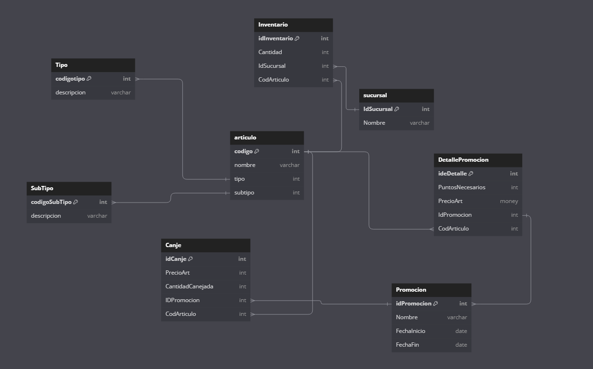

# TestPromerica
A continuación se encontrará la prueba resuelta.

## Pregunta 1.
1.	Escriba el código de una página ASPX que solicite el nombre del usuario, contraseña, y que valide que los campos no vayan vacíos antes de enviar la solicitud al servidor.

[ASPX Valida Campos vacios](./Code%20Pregunta%201//WebApplication1/Default.aspx)

## Pregunta 2.
2.	Escriba un documento XML que permita intercambiar información de tarjetas de crédito entre dos sistemas distintos: nombre del sistema, localización, número de tarjeta, ID único de cliente, etc.

[XMl Transacción](./infotransaccion.xml)

## Pregunta 3.
3.	Escriba la consulta en SQL que devuelva el nombre del proyecto y sus productos correspondientes del proyecto premia cuyo código es 1

```sql 
SELECT 
        p.NOMBRE AS ProyectoNombre,
        prod.DESCRIPCION AS NombreProducto 
FROM PROYECTO p
INNER JOIN PRODUCTO_PROYECTO pp ON pp.PROYECTO = p.PROYECTO
INNER JOIN PRODUCTO prod ON pp.PRODUCTO = prod.PRODUCTO
WHERE p.PROYECTO = 1 
```

## Pregunta 4.
4.	Escriba una consulta SQL que devuelva los distintos mensajes que hay, indicando a qué proyecto y producto pertenecen.

```sql 
SELECT 
    m.COD_MENSAJE AS Mensaje,
    p.NOMBRE AS NombreProyecto,
    prod.DESCRIPCION AS NombreProducto
FROM MENSAJE m
INNER JOIN FORMATO_MENSAJE fm ON m.COD_FORMATO = fm.COD_FORMATO
INNER JOIN PROYECTO p ON m.PROYECTO = p.PROYECTO
INNER JOIN PRODUCTO prod ON m.PRODUCTO = prod.PRODUCTO;
```

## Pregunta 5.
5.	Escriba una consulta SQL que devuelva los distintos mensajes que hay, indicando a qué proyecto y producto pertenecen. Pero si el mensaje está en todos los productos de un proyecto, en lugar de mostrar cada producto, debe mostrar el nombre del proyecto y un solo producto que diga “TODOS”.

```sql 
SELECT 
    m.COD_MENSAJE AS MensajeCodigo,
    p.NOMBRE AS ProyectoNombre,
    CASE 
        WHEN COUNT(DISTINCT pp.PRODUCTO) = (SELECT COUNT(*) FROM PRODUCTO_PROYECTO WHERE PROYECTO = p.PROYECTO) 
        THEN 'TODOS'
        ELSE STRING_AGG(prod.DESCRIPCION, ', ') 
    END AS ProductoDescripcion
FROM MENSAJE m
INNER JOIN FORMATO_MENSAJE fm ON m.COD_FORMATO = fm.COD_FORMATO
INNER JOIN PROYECTO p ON m.PROYECTO = p.PROYECTO
INNER JOIN PRODUCTO_PROYECTO pp ON p.PROYECTO = pp.PROYECTO
INNER JOIN PRODUCTO prod ON pp.PRODUCTO = prod.PRODUCTO
GROUP BY m.COD_MENSAJE, p.NOMBRE;
```


## Pregunta 6.
4.	Escrba el código de una clase, en sintaxis C# que permita hacer conexiones a una base de datos cualquiera, y que devuelva en uno de sus métodos un Dataset al hacer un SELECT, y en otro de sus métodos el número de filas afectadas al ejecutar un INSERT, UPDATE o DELETE. También debe poder devolver el número de filas que devolvería un SELECT si se ejecutara.

[Conexión base de datos](./conexiondb.cs)

## Pregunta 7.
5.	Construya un modelo Entidad Relación que permita llevar el control de Canje de sus puntos acumulados por premios.
    -	El artículo debe tener código, nombre, tipo y subtipo.
    _	Se debe manejar la existencia de artículos por sucursal. Ejemplo, está la sucursal Promerica Majadas y Promerica Columbus y en cada sucursal existen artículos como DVD de Disney, lapiceros, mouse, etc. Y cada sucursal debe saber qué cantidad posee en inventario.
    -	Van a existir varias promociones para canjear y estas van a estar compuestas por varios artículos. Estas promociones poseen rangos de fecha de vigencia y en dichas promociones estará el costo de los puntos y el precio del artículo
    -	El canje debe tener ID del artículo, Cantidad Canjeada, Precio del artículo, la promoción y observaciones.

### Entidad Relación
  